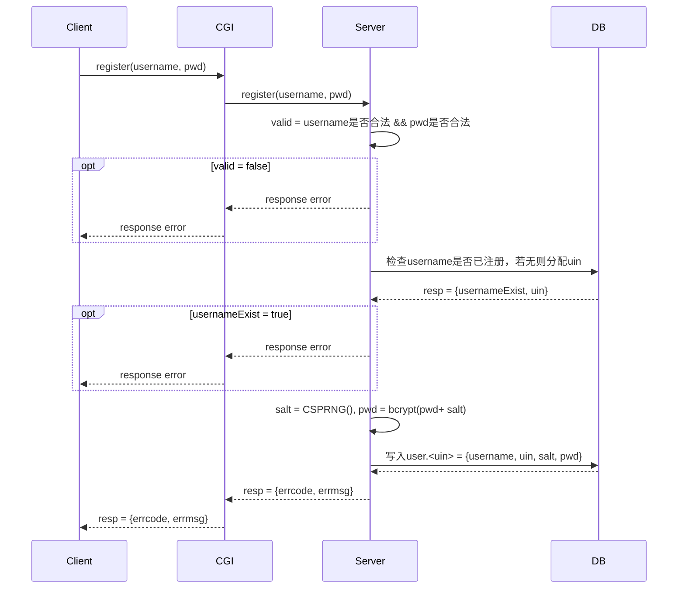
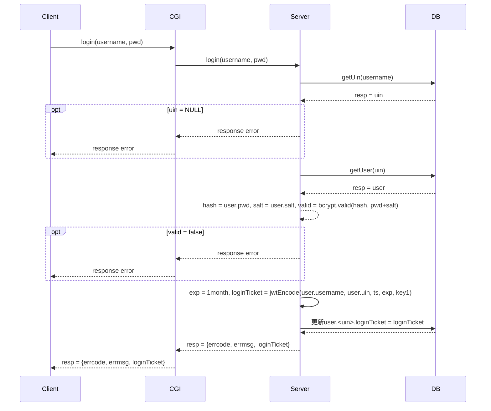
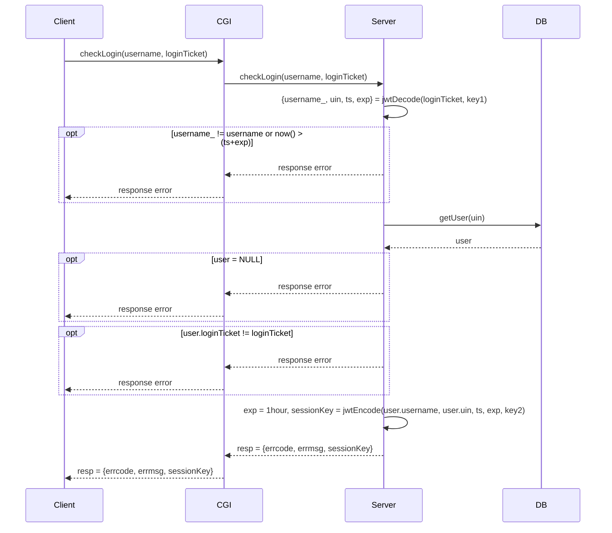
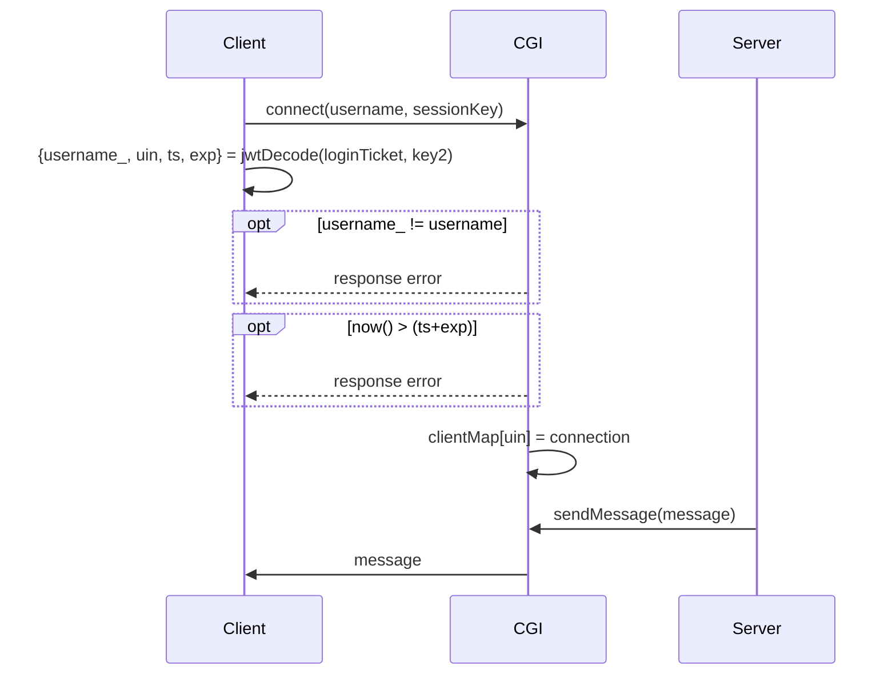
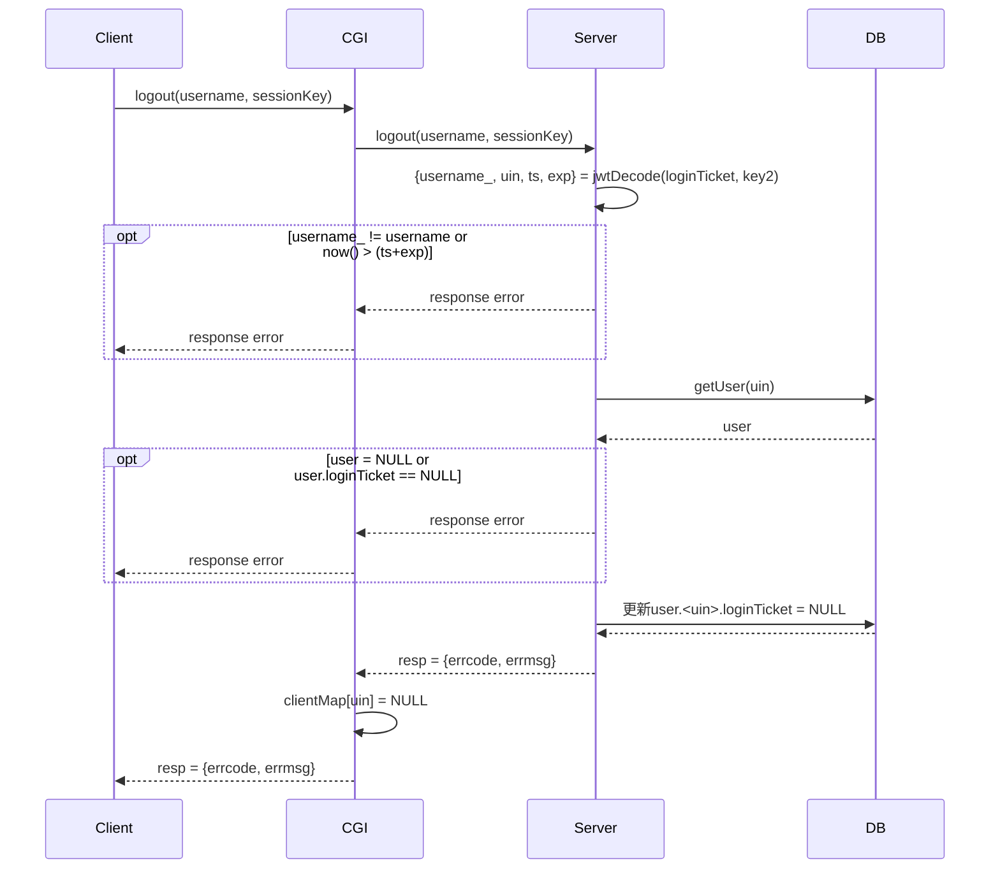

# 调用时序说明

## 用户注册

```mermaid
sequenceDiagram

Client ->> CGI: register(username, pwd)
CGI ->> Server: register(username, pwd)
Server ->> Server: valid = username是否合法 && pwd是否合法
opt valid = false
Server -->> CGI: response error
CGI -->> Client: response error
end
Server ->> DB: 检查username是否已注册，若无则分配uin
DB -->> Server: resp = {usernameExist, uin}
opt usernameExist = true
Server -->> CGI: response error
CGI -->> Client: response error
end

Server ->> Server : salt = CSPRNG(), pwd = bcrypt(pwd+ salt)
Server ->> DB: 写入user.<uin> = {username, uin, salt, pwd}
DB -->> Server: 
Server -->> CGI: resp = {errcode, errmsg}
CGI -->> Client: resp = {errcode, errmsg}

```

## 手动登录

```mermaid
sequenceDiagram

Client ->> CGI: login(username, pwd)
CGI ->> Server: login(username, pwd)
Server ->> DB: getUin(username)
DB -->> Server: resp = uin

opt uin = NULL
Server -->> CGI: response error
CGI -->> Client: response error
end

Server ->> DB: getUser(uin)
DB -->> Server: resp = user

Server -->> Server: hash = user.pwd, salt = user.salt, valid = bcrypt.valid(hash, pwd+salt) 
opt valid = false
Server -->> CGI: response error
CGI -->> Client: response error
end

Server ->> Server: exp = 1month, loginTicket = jwtEncode(user.username, user.uin, ts, exp, key1)
Server ->> DB: 更新user.<uin>.loginTicket = loginTicket
DB -->> Server: 
Server -->> CGI: resp = {errcode, errmsg, loginTicket}
CGI -->> Client: resp = {errcode, errmsg, loginTicket}
```

## 自动登录

```mermaid
sequenceDiagram

Client ->> CGI: checkLogin(username, loginTicket)
CGI ->> Server: checkLogin(username, loginTicket)
Server ->> Server: {username_, uin, ts, exp} = jwtDecode(loginTicket, key1)
opt username_ != username or now() > (ts+exp)
Server -->> CGI: response error
CGI -->> Client: response error
end

Server ->> DB: getUser(uin)
DB -->> Server: user

opt user = NULL
Server -->> CGI: response error
CGI -->> Client: response error
end

opt user.loginTicket != loginTicket
Server -->> CGI: response error
CGI -->> Client: response error
end

Server ->> Server: exp = 1hour, sessionKey = jwtEncode(user.username, user.uin, ts, exp, key2)

Server -->> CGI: resp = {errcode, errmsg, sessionKey}
CGI -->> Client: resp = {errcode, errmsg, sessionKey}

```

## 用户连接

```mermaid
sequenceDiagram

Client ->> CGI: connect(username, sessionKey)
Client ->> Client: {username_, uin, ts, exp} = jwtDecode(loginTicket, key2)

opt username_ != username
CGI -->> Client: response error
end
opt now() > (ts+exp)
CGI -->> Client: response error
end

CGI ->> CGI: clientMap[uin] = connection

Server ->> CGI: sendMessage(message)
CGI ->> Client: message
```

## 退出登录

```mermaid
sequenceDiagram

Client ->> CGI: logout(username, sessionKey)
CGI ->> Server: logout(username, sessionKey)
Server ->> Server: {username_, uin, ts, exp} = jwtDecode(loginTicket, key2)

opt username_ != username or now() > (ts+exp)
Server -->> CGI: response error
CGI -->> Client: response error
end

Server ->> DB: getUser(uin)
DB -->> Server: user

opt user = NULL or user.loginTicket == NULL
Server -->> CGI: response error
CGI -->> Client: response error
end

Server ->> DB: 更新user.<uin>.loginTicket = NULL
DB -->> Server: 
Server -->> CGI: resp = {errcode, errmsg}
CGI ->> CGI: clientMap[uin] = NULL
CGI -->> Client: resp = {errcode, errmsg}
```